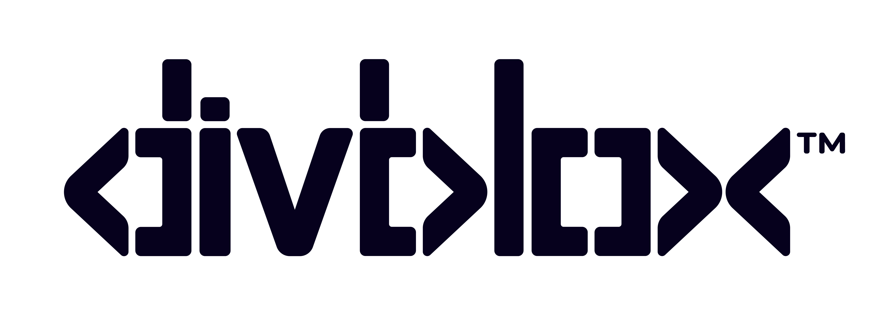

# Divblox MCP

**Turn ideas into delivered work with your AI assistant.**

Connect your AI assistant to Divblox to shape requirements, create and estimate tickets, plan work, and track delivery—all in the projects you choose.

**Manual connection package 0.1.0.** Marketplace listings and approvals are tracked separately.

## Connect your assistant

Use the [manual installation guide](INSTALL.md) to connect a supported client to:

```text
https://mcp.divblox.app/mcp
```

Sign in with your Divblox account, select your projects, and choose permissions for each one. Divblox hosts the server; no local Divblox server is needed. Your existing Divblox access rules still apply.

Manual profiles cover ChatGPT, Claude, Claude Code, Codex, Cursor desktop, VS Code and Gemini CLI. See the guide for prerequisites, callback requirements, validation limits and support for other remote MCP clients. A package is not a claim of universal compatibility or marketplace approval.

## Start with an idea

> Get started in my new project on Divblox.

Tell your assistant what you want to build and which project to use. Work together to refine a requirement, break it into tickets, estimate the work, plan tasks, and publish tickets to delivery.

You can also ask your assistant to:

- Read and refine requirements, including subdocuments and progress updates.
- Create and edit tickets, use templates, and manage checklists and checklist items.
- Link tickets to planning tasks and requirements.
- Move and reorder delivery tickets, and track work using configured lists.
- Read recorded ticket history to help explain progress over time.
- Add supported image attachments to requirements and tickets.

Use project names and record titles. If the target is ambiguous, your assistant should ask you to clarify. Changes require the appropriate project consent and Divblox permissions.

## Stay in control

Choose permissions separately for each project. Add more projects through the connection’s project-access flow without disconnecting existing ones. Sign in only on Divblox’s browser sign-in page; never put passwords or bearer tokens in chats or configuration files.

Connections created before the production-domain migration must be connected again using the production URL above. The retired Azure endpoint is no longer supported for client connections. Keep working branded-domain connections and refresh tools when new capabilities are added.

## Support and known limits

Contact **support@divblox.com** with your client/version, project name, error code and time. Do not include passwords, tokens or complete authorization URLs.

History reports contain recorded events only, and bounded searches can be incomplete. A list with multiple tracking milestones can make aggregate requirement progress ambiguous. Service startup can take several minutes after a deployment; capacity and availability guarantees have not been established.

Gemini writes, consumer Gemini, Windows/Linux desktop and mobile clients are not certified. Production sign-in and project reads were checked in the documented clients; this does not certify every workflow or model. Marketplace approval is tracked separately.

## License

Configuration files and onboarding text use the [MIT license](LICENSE). Divblox logos, trademarks and the hosted service remain separate. This package contains client configuration and documentation; it does not include the hosted server implementation or private operational materials.
